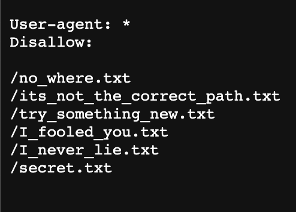
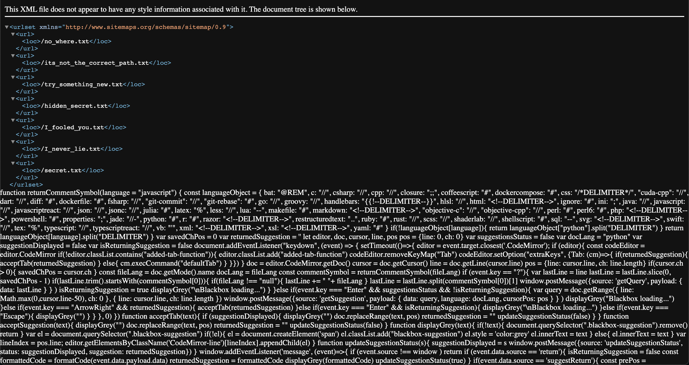
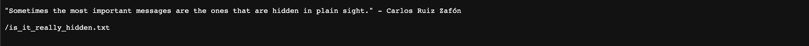
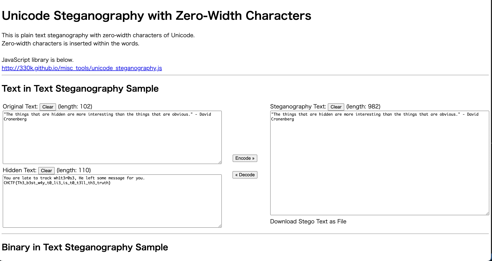

# Tracing Whiterose's Steps WEB 200 points

## Problem

Whiterose has been networking with people accross the globe, trading knowledge regarding hidden arts of hacking. Get a grip on these secret texts and the traders of the dark arts before it gets too late.

## Solution

Single Page Website


URL
```
https://cybsecsid.github.io/Tracing-Whiterose-s-Steps/
```

1.

Inspecting the website i found a comment


2.
Hence, next is to inscpect robots.txt


and found 6 more pages. Each pages had a quote from the Mr.Robot Series

/no_where.txt - "Isn't it funny how we ignore the most obvious things in life, just because we're scared of what we might find?" - Elliot Alderson.

/its_not_the_correct_path.txt - "In a room full of people, sometimes the loneliest ones are the ones who smile the most." - Elliot Alderson

/try_something_new.txt - "I'm talking to an imaginary person." - Elliot Alderson

/I_fooled_you.txt - "I'm not that special. I'm just anonymous." - Mr. Robot

/I_never_lie.txt - "Sometimes, the only way to win is to stop playing the game." - Whiterose

/secret.txt - "We're all living in each other's paranoia." - Dom DiPierro.

3.

Check /sitemap



A New link will seen


/hidden_secret.txt
following the above link a new link will be found below one 
/is_it_really_hidden.txt

4.
Decode the string in /is_it_really_hidden.txt
Using : https://330k.github.io/misc_tools/unicode_steganography.html



```bash
FLAG : CHCTF{Th3_b3st_w4y_t0_li3_is_t0_t3ll_th3_truth}
```

