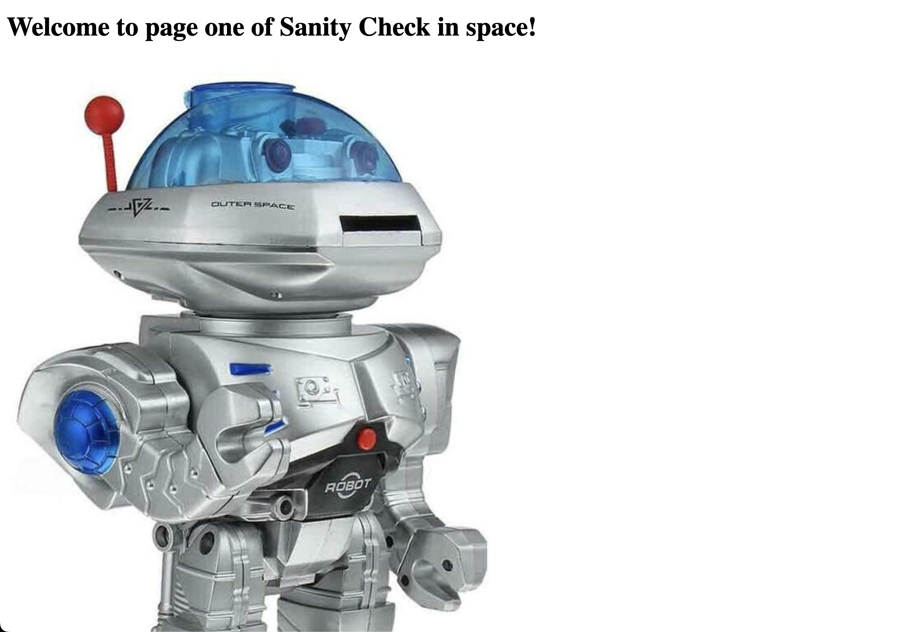

# Sanity Check In Space WEB


## Problem

Man, web exploitation sure is fun. Sometimes you just need to go back to the basics, you know what I mean? Everything you need to get started on your journey to becoming a web master is here.

p.s: You can make anything space themed if you try hard enough.

http://scis.hackers.best:31337/

## Solution

Single Page Website



as usual checks the inspect panel and robots.txt


it shows human.txt


and


taking the hint to check verify as human and the cookie in picture.I changed the cookie human value from false to true


visiting arrakis as per the hint


asks to enter the password 
password is in the view-source 


Next is input tab to ping a website.


The playload is
```bash
;cat flag.txt
```


```bash
Flag: shctf{exp01ting_w3bs1tes_1N_SP@C3}
```


