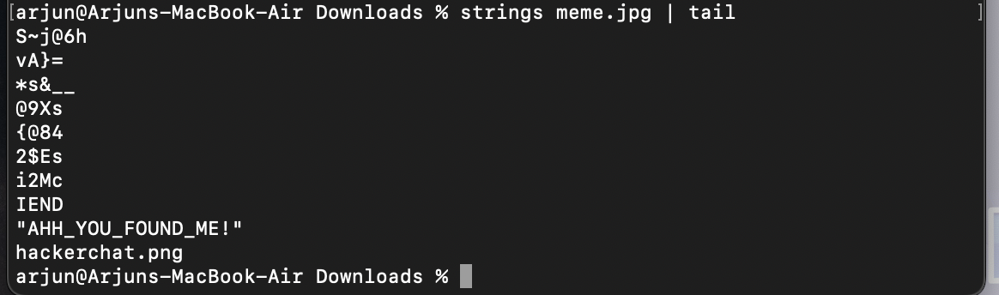

#  Security through obscurity

## Problem
Security through obscurity is the reliance in security engineering on the secrecy of the design or implementation as the main method of providing security for a system or component of a system.


## Solution

1. Use strings to find first flag



```bash
FLAG:  hackerchat.png
```

2. The string above firstflag is the second flag


```bash
FLAG:  AHH_YOU_FOUND_ME!
```

