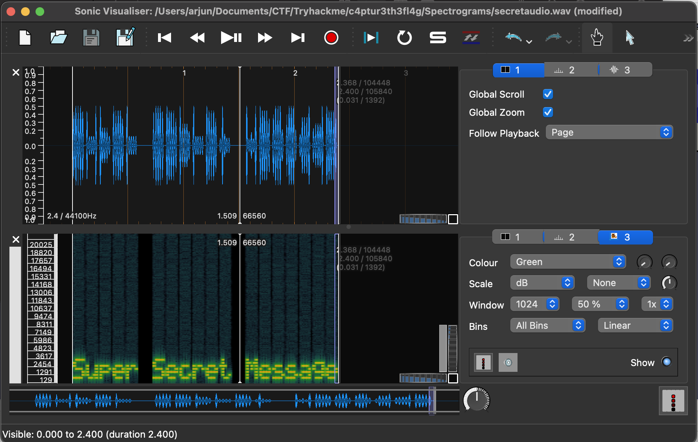

# Spectrograms Task 2

## Problem
A spectrogram is a visual representation of the spectrum of frequencies of a signal as it varies with time. When applied to an audio signal, spectrograms are sometimes called sonographs, voiceprints, or voicegrams. When the data is represented in a 3D plot they may be called waterfalls. 

.wav is in the dir.

## Solution

Use [Sonic-Visualiser](https://www.sonicvisualiser.org/download.html) to analyse the specturm




```bash
FLAG:  Super Secret Message
```

