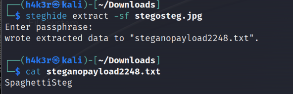

#  Steganography Task 3

## Problem
Steganography is the practice of concealing a file, message, image, or video within another file, message, image, or video.
.jpg is in the dir.


## Solution

Use steghide tool to extract data




```bash
FLAG:  SpaghettiSteg
```

